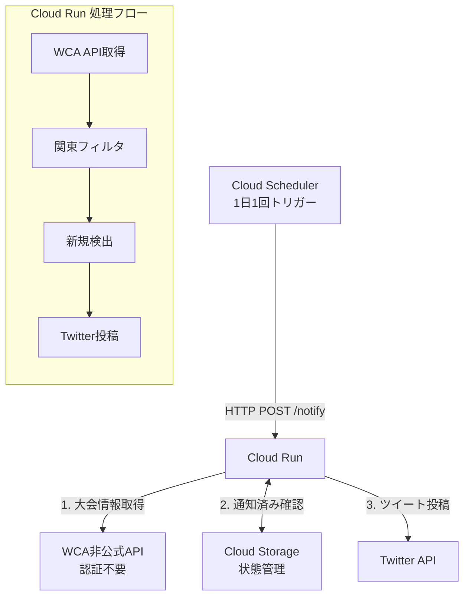

# WCA関東大会通知Bot

WCA（World Cube Association）の関東地方で開催される新規大会をTwitter/Xに自動投稿するBot。

## 機能

- WCA APIから日本の大会情報を取得
- 関東地方（東京、神奈川、千葉、埼玉、茨城、栃木、群馬）の大会を抽出
- 新規大会を検出してTwitter/Xに投稿
- 重複投稿を防止（通知済み大会を記録）

## ツイート例

```
🧊 新しいWCA大会が発表されました！

📅 Tokyo Summer 2025
🗓 2025年8月15日
📍 Tokyo
🎯 3x3x3, 2x2x2, 4x4x4, 3x3x3片手, 5x5x5 他2種目

詳細・申込み👇
https://www.worldcubeassociation.org/competitions/TokyoSummer2025

#WCA #スピードキューブ #ルービックキューブ
```

## 開発計画

### Phase 1: ローカル開発 ✅
- [x] WCA APIクライアント実装
- [x] 関東フィルタリングロジック
- [x] ツイート文面生成
- [x] Twitter投稿クライアント（DryRunモード対応）
- [x] 状態管理（ローカルJSONファイル）
- [x] FastAPIエントリーポイント
- [x] ローカルテストスクリプト

### Phase 2: Cloud Runデプロイ
- [ ] Dockerfile作成
- [ ] Cloud Runへデプロイ
- [ ] Cloud Storageで状態管理
- [ ] Secret Managerで認証情報管理

### Phase 3: 自動化
- [ ] Cloud Scheduler設定（1日1回実行）
- [ ] エラー通知設定（Cloud Logging/Alerting）
- [ ] 本番運用開始

### 将来の拡張（Nice to have）
- [ ] 登録開始日・締切日の通知
- [ ] 締切リマインダー
- [ ] 他地域対応（関西、東海など）
- [ ] Discord/LINE対応

## セットアップ

### 必要なもの
- Python 3.11+
- [rye](https://rye-up.com/)（パッケージ管理）
- Twitter API認証情報（Freeプランで可）

### インストール

```bash
# リポジトリをクローン
git clone https://github.com/pyonkichi499/wca-competitions-notifier.git
cd wca-competitions-notifier

# 依存関係をインストール
rye sync

# 環境変数を設定
cp .env.example .env
# .env を編集してTwitter認証情報を入力
```

### ローカル実行

```bash
# DryRunモードでテスト（実際には投稿しない）
rye run python scripts/run_local.py

# FastAPIサーバー起動
rye run uvicorn src.main:app --reload
# http://localhost:8000/docs でSwagger UI確認
```

## APIエンドポイント

| メソッド | パス | 説明 |
|---------|------|------|
| GET | `/` | ヘルスチェック |
| POST | `/notify` | 新規大会チェック＆Twitter投稿 |
| GET | `/competitions` | 関東大会一覧（デバッグ用） |
| GET | `/preview/{id}` | ツイートプレビュー |

## アーキテクチャ



## 技術スタック

- **言語**: Python 3.11
- **Webフレームワーク**: FastAPI
- **HTTPクライアント**: httpx（非同期）
- **Twitter連携**: tweepy
- **実行環境**: Google Cloud Run
- **スケジューラ**: Google Cloud Scheduler
- **状態保存**: ローカルJSON / Google Cloud Storage
- **パッケージ管理**: rye

## ライセンス

MIT
